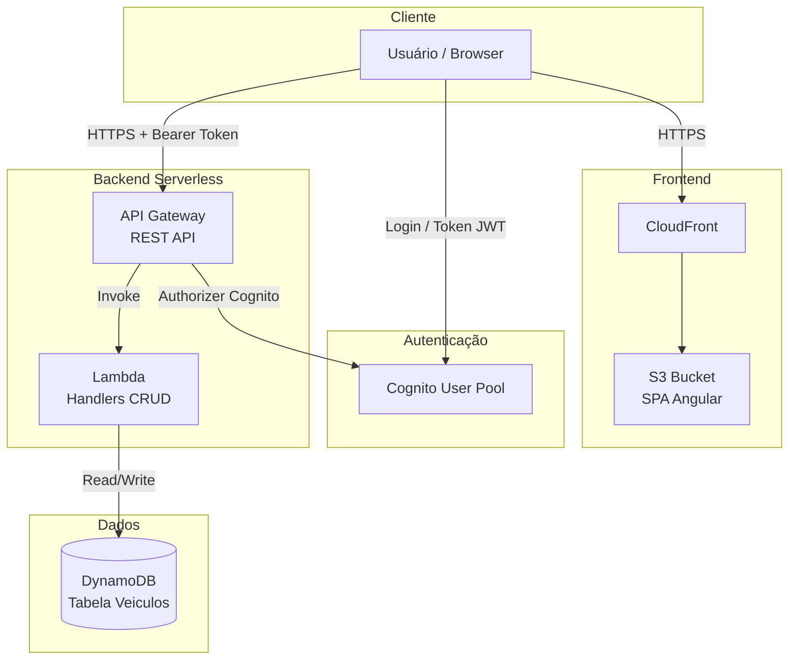

# Arquitetura do Sistema

Este documento descreve a arquitetura de alto nível do **testproject**, uma aplicação web serverless na AWS para gestão de veículos.

## Visão geral

O projeto adota uma arquitetura **Serverless** em camadas, com frontend estático, APIs REST sem servidor e infraestrutura declarada como código (IaC). Os componentes centrais da stack backend são:

| Componente | Serviço AWS | Responsabilidade |
|------------|-------------|------------------|
| Entrada de API | **API Gateway** | Expor endpoints REST, roteamento por stage e integração com authorizer |
| Lógica de negócio | **Lambda** | Processar requisições, validar dados e orquestrar persistência |
| Persistência | **DynamoDB** | Armazenar entidades da aplicação (ex.: `Veiculos`) |
| Autenticação | **Cognito** | Cadastro, login, confirmação por e-mail e MFA |

O frontend é uma SPA Angular servida via **S3** e **CloudFront**. A infraestrutura é provisionada com **AWS CDK (TypeScript)** na pasta `infra/`.

## Diagrama lógico de componentes

O diagrama abaixo representa o fluxo principal entre os componentes da stack Serverless:



### Descrição textual dos componentes

1. **Usuário / Browser** — Acessa a SPA pelo domínio do CloudFront e consome a API REST do API Gateway.
2. **CloudFront + S3** — Distribui o frontend estático (Angular). O bucket S3 permanece privado, com acesso via OAC (Origin Access Control).
3. **Amazon Cognito** — Gerencia identidade: auto cadastro, confirmação por e-mail, MFA e emissão de tokens JWT usados nas rotas protegidas.
4. **API Gateway** — Ponto de entrada das APIs REST. Define stages por ambiente (`development`, `test`, `staging`, `production`) e aplica o Cognito Authorizer nas rotas seguras.
5. **AWS Lambda** — Executa a lógica de negócio (handlers Node.js). Cada função é invocada pelo API Gateway e possui permissões IAM mínimas para acessar o DynamoDB.
6. **DynamoDB** — Banco NoSQL serverless. A tabela principal (`Veiculos`) armazena os registros da aplicação com partition key padronizada por ambiente.

## Fluxo de uma requisição autenticada

1. O usuário autentica-se no **Cognito User Pool** e recebe um token JWT (ID ou Access Token).
2. O frontend envia a requisição HTTP ao **API Gateway** com o header `Authorization: Bearer <token>`.
3. O **Cognito Authorizer** valida o token antes de encaminhar a chamada.
4. O **API Gateway** invoca a **Lambda** correspondente ao recurso/rota.
5. A **Lambda** lê ou grava dados na tabela **DynamoDB** e retorna a resposta HTTP.

## Ambientes

A mesma conta AWS hospeda quatro ambientes segregados por stage:

| Stage | Uso |
|-------|-----|
| `development` | Desenvolvimento e testes locais integrados |
| `test` | Validação automatizada e QA |
| `staging` | Homologação pré-produção |
| `production` | Ambiente produtivo |

Cada stage possui recursos isolados (buckets S3, distribuições CloudFront, stages do API Gateway, tabelas DynamoDB e configurações Cognito).

## Estrutura do repositório

```
testproject/
├── frontend/   # SPA Angular
├── backend/    # Handlers Lambda e lógica de API
├── infra/      # Stacks AWS CDK (TypeScript)
└── docs/       # Documentação (incluindo este arquivo)
```

## Documentação relacionada

- [README principal](../../README.md) — visão geral e guia de setup local
- [Tarefas de infraestrutura](../project-management/tasks/) — épicos e tasks de implementação (Cognito, API Gateway, DynamoDB, Lambda)
- [Casos de teste](../test-cases/) — critérios de validação automatizados
