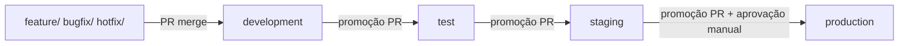

# Estratégia de Branches

Este documento define as convenções de nomenclatura de branches e o fluxo de promoção de código entre ambientes do projeto **testproject**.

## Visão geral

O repositório utiliza **branches de longa duração** alinhadas aos ambientes de deploy e **branches de trabalho** derivadas delas para desenvolvimento diário. Toda alteração entra via Pull Request (PR) e progride pelos ambientes na ordem fixa abaixo.

```text
feature/ | bugfix/ | hotfix/
            ↓ (PR)
      development
            ↓ (promoção)
          test
            ↓ (promoção)
        staging
            ↓ (promoção + aprovação manual)
       production
```

## Branches de ambiente (long-lived)

| Branch        | Ambiente     | Propósito                                              |
|---------------|--------------|--------------------------------------------------------|
| `development` | development  | Integração contínua do time; primeiro ambiente deployado |
| `test`        | test         | Validação funcional e testes automatizados             |
| `staging`     | staging      | Pré-produção; validação final antes do release         |
| `production`  | production   | Ambiente produtivo; exige aprovação manual no pipeline |

Essas branches são protegidas: pushes diretos são bloqueados e merges exigem PR com review e status checks (ver TASK-003).

## Convenções de nomenclatura (branches de trabalho)

Toda branch de trabalho deve usar um dos prefixos abaixo, seguido de identificador descritivo (issue, ticket ou resumo curto em kebab-case).

### `feature/`

Usada para **novas funcionalidades** ou melhorias que não corrigem defeitos em produção.

**Formato:** `feature/<identificador>`

**Exemplos:**

- `feature/ISSUE-42-user-auth`
- `feature/dashboard-filters`

**Fluxo:** criar a partir de `development` → PR para `development`.

### `bugfix/`

Usada para **correções de defeitos** encontrados em ambientes não produtivos (development, test ou staging).

**Formato:** `bugfix/<identificador>`

**Exemplos:**

- `bugfix/ISSUE-57-login-timeout`
- `bugfix/staging-api-500`

**Fluxo:** criar a partir da branch do ambiente onde o bug foi reproduzido (em geral `development`) → PR para `development`.

### `hotfix/`

Usada para **correções urgentes em produção** que não podem aguardar o ciclo normal de release.

**Formato:** `hotfix/<identificador>`

**Exemplos:**

- `hotfix/ISSUE-99-payment-failure`
- `hotfix/critical-security-patch`

**Fluxo:** criar a partir de `production` → PR para `production` e, após deploy, **backport** via PRs para `staging`, `test` e `development` para manter paridade.

## Fluxo de promoção entre ambientes

A promoção de código segue sempre a sequência abaixo. Não se pula ambientes.

```text
development → test → staging → production
```

Cada etapa representa um aumento no nível de confiança e restrição antes do código chegar aos usuários finais.

### 1. development

- **Origem:** merges de branches `feature/` e `bugfix/` via PR.
- **Deploy:** automático ao merge na branch `development` (TASK-016).
- **Objetivo:** integrar o trabalho do time e validar em ambiente de desenvolvimento.

### 2. test

- **Origem:** promoção a partir de `development` via PR (`development` → `test`).
- **Deploy:** automático ao merge na branch `test` (TASK-017).
- **Objetivo:** executar suíte de testes, QA e validações de regressão em ambiente dedicado.

### 3. staging

- **Origem:** promoção a partir de `test` via PR (`test` → `staging`).
- **Deploy:** automático ao merge na branch `staging` (TASK-018).
- **Objetivo:** espelhar produção o mais fielmente possível; última validação antes do release.

### 4. production

- **Origem:** promoção a partir de `staging` via PR (`staging` → `production`).
- **Deploy:** acionado pelo merge na branch `production`, com **aprovação manual obrigatória** no pipeline (TASK-019).
- **Objetivo:** disponibilizar a release para usuários finais.

### Diagrama de promoção



## Regras gerais

1. **Nunca fazer push direto** em `development`, `test`, `staging` ou `production`.
2. **Respeitar a ordem de promoção:** `development` → `test` → `staging` → `production`.
3. **Manter branches de trabalho curtas:** merge frequente em `development` reduz conflitos.
4. **Hotfixes** seguem caminho acelerado para `production`, com backport obrigatório para branches inferiores.
5. **Cada PR de promoção** deve referenciar a release ou conjunto de changes sendo promovido.

## Referências

- [TASK-002 — Definir padrões de branch](../project-management/tasks/TASK-002.md)
- [TASK-003 — Configurar proteção de branches](../project-management/tasks/TASK-003.md)
- [~EPIC-001 — Foundation~ ~~**✅ Concluído**~~](../project-management/tasks/EPIC-001.md)
